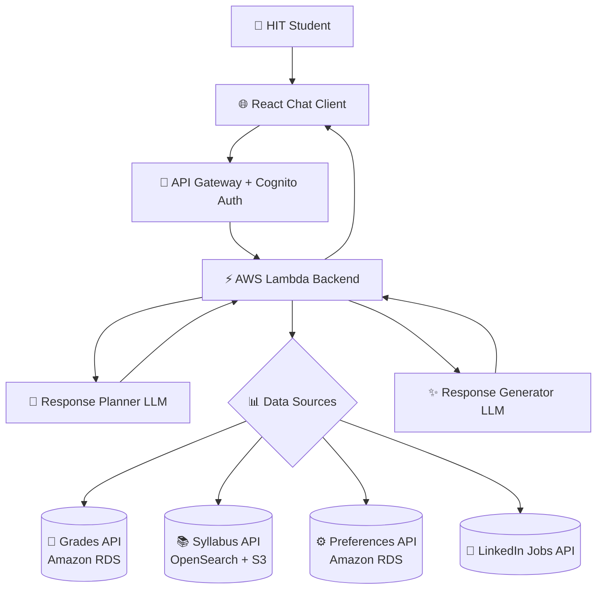

# 🎓 MentorHIT – Your AI Academic & Career Companion

*Transforming academic journeys at HIT through intelligent, personalized guidance*

[](https://aws.amazon.com/)
[](https://reactjs.org/)
[](https://aws.amazon.com/bedrock/)
[](https://www.typescriptlang.org/)

---

## 🌟 What Makes MentorHIT Special?

MentorHIT isn't just another chatbot – it's your personal academic strategist that understands **you**, your goals, and the real opportunities waiting for you at HIT and beyond.

### 🎯 **Smart. Personal. Actionable.**
- 📚 **Course Recommendations** tailored to your interests and academic performance
- 💼 **Career Pathways** based on real job market data and your unique profile  
- 🤖 **AI-Powered Conversations** that understand context and remember your preferences
- 📊 **Data-Driven Insights** from actual HIT syllabi, grades, and LinkedIn opportunities

---

## 🚀 The Problem We're Solving

Many students struggle with course selection and career planning. At HIT, we hear these questions daily:

> *"Which electives will actually help my career?"*  
> *"How do I turn my CS degree into a dream job?"*  
> *"What should I focus on this semester?"*

**MentorHIT provides the answers** – personalized, intelligent, and always available.

---

## 🏗️ System Architecture

Our cloud-native architecture is built for scale, security, and lightning-fast responses:



### 🔄 **Intelligent Query Flow**

1. **🎯 Smart Planning**: Your question hits our Response Planner (LLM) which decides exactly what data you need
2. **📊 Data Gathering**: We fetch your grades, course history, preferences, and live job data in parallel
3. **✨ Response Generation**: Another LLM crafts a personalized response using all your data
4. **💬 Conversational Magic**: You get actionable advice that feels human, backed by real data

---

## 🛠️ Tech Stack

### Frontend Excellence
- **React 18** with modern hooks and TypeScript
- **Tailwind CSS** for beautiful, responsive design
- **Lucide React** icons for crisp UI elements
- **Real-time chat** interface with typing indicators

### Backend Power
- **AWS Lambda** serverless functions for instant scaling
- **Amazon Bedrock** with advanced LLMs for natural conversations
- **API Gateway** with Cognito authentication
- **Vector Search** via OpenSearch for intelligent course matching

### Data Intelligence
- **Amazon RDS (PostgreSQL)** for structured student data
- **DynamoDB** for lightning-fast chat history
- **Amazon S3** for syllabus documents and assets
- **Titan Embeddings** for semantic course similarity
- **LinkedIn API** for real-time job opportunities

### Security & Auth
- **Amazon Cognito** with HIT email domain validation
- **OTP verification** for secure access
- **JWT session management** for seamless experience

---

## 🌈 Key Features

### 🎯 **Academic Intelligence**
- **Smart Course Recommendations** based on your grades and interests
- **Syllabus Analysis** using vector embeddings for perfect course matches
- **Performance Insights** to identify your academic strengths

### 💼 **Career Guidance**
- **Live Job Matching** from LinkedIn based on your skills
- **Career Path Planning** aligned with HIT curriculum
- **Industry Trend Analysis** to future-proof your choices

### 💬 **Chat Experience**
- **Context-Aware Conversations** that remember your preferences
- **Multi-Step Planning** for complex academic decisions
- **Instant Responses** with professional formatting and insights

### 🔐 **Security First**
- **HIT Email Validation** ensures exclusive access for students
- **Secure Data Handling** compliant with Israeli privacy laws
- **Anonymous Analytics** to improve recommendations without compromising privacy

---

## 🚀 Getting Started

### Prerequisites
- HIT student email address
- Modern web browser
- Internet connection

### Authentication Flow
```
1. 📧 Enter your HIT email
2. 🔐 Domain validation (automatic)
3. 📱 Receive OTP via email
4. ✅ Verify and start chatting!
```

---

## 💡 Sample Conversations

**Student**: *"I'm struggling with math but love coding. What courses should I take next semester?"*

**MentorHIT**: *Based on your grades in CS101 (85%) and Calculus (65%), I recommend:*
- *📚 **Data Structures** - builds on your coding strength*
- *🎯 **Discrete Math** - gentler math approach for CS*
- *💼 **3 LinkedIn internships** match your profile perfectly*

**Student**: *"Show me jobs for React developers in Tel Aviv"*

**MentorHIT**: *Found 12 React positions! Here are the top matches:*
- *🚀 **Junior Frontend Dev** at startup (95% match)*
- *🏢 **React Developer** at tech company (88% match)*
- *📈 Based on your HIT courses, you're missing: TypeScript, Testing*

## 🔮 What's Next?

- **📱 Mobile App** for on-the-go academic planning
- **🤝 Integration** with HIT's official systems
- **📈 Advanced Analytics** for academic performance prediction
- **🎪 Campus Events** integration and recommendations

---

## 👥 Meet the Team

**🚀 The Builders Behind MentorHIT**

| Name | 
|------|
| **Lior Lamachinsky** (M.Sc.) |
| **Daniel Podolsky** (B.Sc.) |
| **Dvir Uliel** (B.Sc.) |
| **Noy Klar** (B.Sc.) |

---

## 🤝 Contributing

We're always looking for ways to make MentorHIT better for HIT students!

### How to Help
- 🐛 **Report Bugs** via our feedback system
- 💡 **Suggest Features** that would help your academic journey
- 📝 **Share Success Stories** to inspire other students
- 🧪 **Beta Testing** new features before release

---

<div align="center">

### ⭐ **MentorHIT: Where AI Meets Academic Success** ⭐

*Built with ❤️ by HIT students, for HIT students*

---

*© 2025 MentorHIT Team - Holon Institute of Technology*  
*Making academic dreams achievable, one conversation at a time* 🎓✨

</div>
